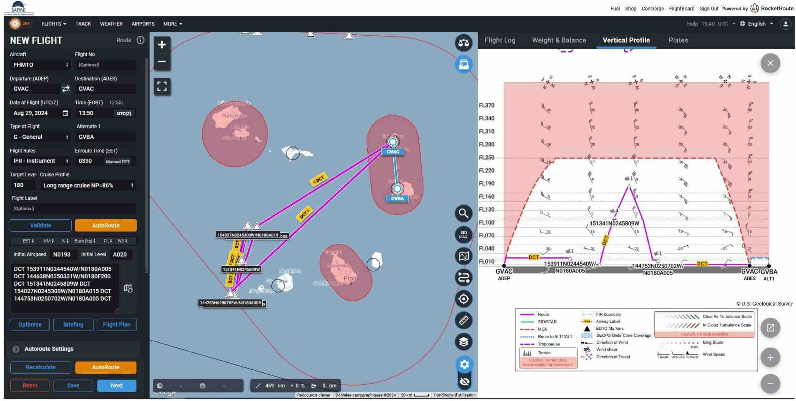

---
jupytext:
  text_representation:
    extension: .md
    format_name: myst
    format_version: 0.12
    jupytext_version: 1.7.1
kernelspec:
  display_name: Python 3
  language: python
  name: python3
platform: ATR
flight_id: ATR-20240830a
takeoff: "2024-08-30 19:00:00Z"
landing: "2024-08-30 22:30:00Z"
departure_airport: GVAC
arrival_airport: GVAC
crew:
  - name: 
    job: Pilot
  - name: 
    job: Pilot
  - name: 
    job: Mechanics
  - name: 
    job: Expé Principal
  - name: 
    job: Expé 
  - name: Sandrine Bony
    job: PI
  - name: 
    job: LNG
  - name: 
    job: aWALI
  - name: 
    job: Microphys 1
  - name: 
    job: Microphys 2
  - name: 
    job: RASTA
  - name: 
    job: BASTA
categories: []
orphan: true
---

{logo}`MAESTRO`

# Flight plan - {front}`flight_id`

```{badges}
```

## Flight plan
* The flight is planned to take off at {front}`takeoff` UTC and land at {front}`landing` UTC.
* Flight plan designed to sample a predicted convergence line to the SE of Sal, oriented SSW-NNE and potentially coinciding with the trough of the African Easterly Wave. There appears to be a strong gradient in column water vapor.
* Typical MAESTRO flight plan with legs in the subcloud layer, cloud base, and mid troposphere.

```{code-cell} python3
:tags: [hide-input]
from orcestra.flightplan import sal, bco, LatLon, IntoCircle, path_preview, plot_cwv, plot_usurf
import matplotlib.pyplot as plt

from datetime import datetime
import intake

cat = intake.open_catalog("https://tcodata.mpimet.mpg.de/internal.yaml")

date_time = datetime(2024, 8, 28, 12, 0, 0)
date_time_str = date_time.strftime('%Y-%m-%d')
flight_time = datetime(2024, 8, 30, 18, 0, 0)

airport = sal
wp1 = LatLon(lat=16.204, lon=-22.5, label='wp1')
wp2 = LatLon(14.550, lon=-21.675, label='wp2')

path = [airport, wp1, wp2, wp1,airport]

ds = cat.HIFS(refdate=date_time_str, reftime=date_time.hour).to_dask()
cwv_flight_time = ds["tcwv"].sel(time=flight_time, method = "nearest")
ax = path_preview(path)
ax.set_extent([-26, -19, 12.5, 17.5])
plot_cwv(cwv_flight_time)
plt.title('COLUMN WATER VAPOR')

u_latest = ds["10u"].sel(time=flight_time, method = "nearest")
v_latest = ds["10v"].sel(time=flight_time, method = "nearest")
time_of_usurf = ds["time"].sel(time=flight_time, method = "nearest")
usurf_latest = (u_latest ** 2 + v_latest ** 2) ** (1/2)
# Plot the flight path
ax = path_preview(path)
# PLot the surface wind speed
ax.set_extent([-26, -19, 12.5, 17.5])
plot_usurf(usurf_latest,levels=[0, 3])
plt.title('SURFACE WIND SPEED')

import healpix as hp
import numpy as np
import xarray as xr
MESH_GRID_SIZE = 50
QUIVER_SKIP = 2
def wind_direction_plot(ds, u10m, v10m, ax):
    # lon_min, lon_max, lat_min, lat_max = ORCESTRA_DOMAIN
    lon_min, lon_max, lat_min, lat_max = -26, -18, 12, 19
    lon1 = np.linspace(lon_min, lon_max, MESH_GRID_SIZE)
    lat1 = np.linspace(lat_min, lat_max, MESH_GRID_SIZE)
    pix = xr.DataArray(
        hp.ang2pix(
            ds.crs.healpix_nside,
            *np.meshgrid(lon1, lat1),
            nest=True,
            lonlat=True,
        ),
        coords=(("lat1", lat1), ("lon1", lon1)),
    )
    Q0 = ax.quiver(
        lon1[::QUIVER_SKIP],
        lat1[::QUIVER_SKIP],
        u10m.isel(cell=pix)[::QUIVER_SKIP, ::QUIVER_SKIP],
        v10m.isel(cell=pix)[::QUIVER_SKIP, ::QUIVER_SKIP],
        color="gray",
        pivot="middle",
        scale_units="inches",
        width=0.003,
        scale=20,
    )
    ax.quiverkey(
        Q0,
        0.95,
        1.05,
        10,
        r"$10 \frac{m}{s}$",
        labelpos="E",
        coordinates="axes",
        animated=True,
    )

wind_direction_plot(ds,u_latest,v_latest,ax)


```
<!--  -->

<!-- <!-- * SAFIRE Flight Plan submitted to Air Traffic Control (ATC) -->

<!--  -->

```{code-cell} python3
:tags: [hide-input]
import pandas as pd
from dataclasses import asdict

pd.DataFrame.from_records(map(asdict, path)).set_index("label")
```

## Crew

```{crew}
```