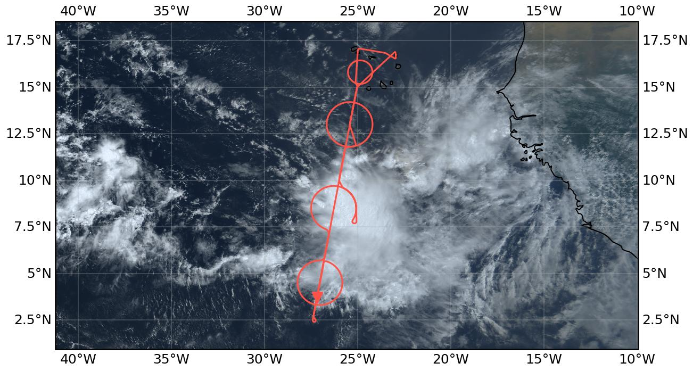

{logo}`PERCUSION`

# {front}`flight_id`

```{badges}
```

## Crew

```{crew-list}
```

## Track

 

Flight path superimposed on the natural color image from NOAA's Geostationary Operational Environmental Satellites (GOES) 16 satellite on August 29, 2024 at 15:20 UTC. The location of the aircraft at the time of the satellite image is highlighted.

## Conditions

```{track-animation}
:flight_id: HALO-20240829a
```

Strong Mesoscale Convective System (MCS) visible in Satellite Image right to the East of the flight track in the morning of the flight. The system was not forecasted in the vicinity of our flight track the day(s) before and moved into our flight path during the day. Strong turbulence was experienced on our way to the south, crossing the eastern edge of the system.

Increased cloudiness was observed throughout the flight compared to what was expected from the forecast. Most of the flight we were inside clouds indicating that the cloud top was at least 15 km. In the southernmost part of the flight we had cloud-free conditions, but the southern circle and the EarthCARE overpass was already again in cloudy conditions. The MCS further developed at the location of the middle circle. The circle was started in the south in clockwise direction to avoid passing through the system. Turbulence was experienced in the east and north-east of the system. The circle could be continued to its western part until convection on flight level was to strong. To avoid strong convection inside the system, we followed the circle again to the north. The northern track was again in clouds. But a descend to FL350 for the ATR circle brought us below the cirrus cloud. The northern part of the flight was characterized by Saharan dust and some scattered low clouds.


## Execution

The flight started as planned with a long leg towards the southern point, following the EarthCARE track. We turned and flew the southern circle as planned. For the middle circle we had to avoid convection within the MCS and started from the south on the eastern part. We could do about 70% of the circle until convection on flight level prevented us from going further. We had to fly on the same route back to the north. The northern circle was performed as planned. Afterwards we descended to FL350 to do the ATR (alternative) circle, did a Midelo overpass and returned back to Sal.

## Impressions

Convection on the flight track was much more active than forecasted. In addition, there were more and higher clouds than expected from the forecasts the days before.


````{card-carousel} 2

```{card}
:img-top: ../figures/HALO-20240829a/flight_crew.jpg
Scientific Crew
```

```{card}
:img-top: ../figures/HALO-20240829a/altocumulus_in_the_north.jpg
Altocumulus in the north
```

```{card}
:img-top: ../figures/HALO-20240829a/on_our_way_south.jpg
On our way south
```

```{card}
:img-top: ../figures/HALO-20240829a/HALO_on_HALO.jpg
HALO on HALO
```

```{card}
:img-top: ../figures/HALO-20240829a/in_the_circle_in_the_clouds.jpg
In the circle in the clouds
```

```{card}
:img-top: ../figures/HALO-20240829a/scattered_clouds_in_the_south.jpg
Scattered clouds in the south
```

```{card}
:img-top: ../figures/HALO-20240829a/sunset_and_dust.jpg
Sunset and dust
```


````

## Instrument status & quicklooks

```{instrument-table}
```

````{card-carousel} 2

```{card}
:img-top: ../figures/HALO-20240829a/HALO_20240829a_BACARDI_QL.png
BACARDI
```

```{card}
:img-top: ../figures/HALO-20240829a/20240829_circle_profiles.png

Dropsondes: Circle mean profiles
```

```{card}
:img-top: ../figures/HALO-20240829a/hamp_fullflight_HALO-20240829a.png
HAMP 
```

```{card}
:img-top: ../figures/HALO-20240829a/hamp_ec_under_HALO-20240829a.png
HAMP during EarthCARE underpass
```

```{card}
:img-top: ../figures/HALO-20240829a/hamp_radar_ec_under_HALO-20240829a.png
Radar during EarthCARE underpass
```

```{card}
:img-top: ../figures/HALO-20240829a/HALO_20240829a_KT19_QL.png
KT19 Timeseries of brigthness temperature.
```

```{card}
:img-top: ../figures/HALO-20240829a/HALO-20240829-wales-ec.png
WALES (backscatter, polarization and humidity) at EC overpass
```

```{card}
:img-top: ../figures/HALO-20240829a/0829-wales-3d.jpg

WALES (3D backscatter)
```

```{card}
:img-top: ../figures/HALO-20240829a/0829-wales-x.jpg

WALES (cross section)
```

```{card}
[](https://www.meteorologie.lmu.de/~quicklooks/specMACS/PERCUSION/quicklooks/polcams/quicklook_20240829_polb.png)
specMACS RGB snapshots from polb (lower right) with EarthCARE underpass marked in red. Find further quicklooks [here](https://www.meteorologie.lmu.de/~quicklooks/specMACS/PERCUSION/flight_HALO-0829.html).
```

````
